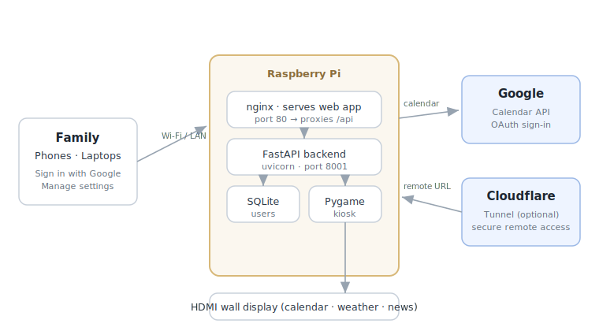

# Family Dashboard

A self-hosted **family calendar kiosk** for a Raspberry Pi. Mount a screen on
the wall and it shows your shared Google Calendar, local weather, and a news
ticker — full-screen, always on. Family members sign in from their phone or
laptop to connect their own calendar and pick their color.

It's free, open source, and runs entirely on a Pi in your home. The only data
that leaves your network is the Google Calendar sync (and, optionally, a
secure tunnel if you want to reach it from outside the house).



> **Screenshot:** drop a photo of your running dashboard at
> `docs/img/dashboard.png` and it will appear here.
>
> 

---

## Features

- 📅 **Shared calendar** — overlays every family member's Google Calendar, each
  in their own color.
- 🌤️ **Local weather** — current conditions and forecast (free, no API key —
  uses Open‑Meteo).
- 📰 **News ticker** — your choice of RSS feeds, plus optional Hacker News and
  dad jokes.
- 👨‍👩‍👧 **Per‑person sign‑in** — each member connects their own calendar; the
  owner controls who's allowed in.
- 🖥️ **Kiosk display** — boots straight into a full‑screen view; no keyboard or
  mouse needed.
- 🔒 **Private by default** — only email addresses you authorize can sign in
  and manage the dashboard.
- 🌐 **Optional remote access** — one‑click Cloudflare Tunnel gives you a
  private `https://…` URL with no port forwarding.
- 🔄 **Safe in‑place updates** — pull tested releases from GitHub right from the
  settings page, with a one‑click backup first.

---

## What you need

- **Raspberry Pi** running Raspberry Pi OS (Bookworm, 64‑bit). A Pi Zero 2 W,
  Pi 3, Pi 4, or Pi 5 all work. (512 MB RAM is enough.)
- An **HDMI display**.
- A **Wi‑Fi network** (or Ethernet).
- A **Google account** with the calendars you want to show.

---

## Install

There are two ways to get it onto a Pi.

### Option A — Run the installer on an existing Pi OS

SSH into a Pi already running Raspberry Pi OS Lite (64‑bit) and run:

```bash
curl -sSL https://raw.githubusercontent.com/dmccollum-gl/family-dashboard/main/pi/setup.sh | sudo bash
```

The script installs everything (Python, nginx, the app, the kiosk service) and
is safe to re‑run. Reboot when it finishes and the display starts automatically.

### Option B — Build a ready‑to‑flash image (macOS)

If you'd rather flash a card and skip the command line on the Pi:

```bash
git clone https://github.com/dmccollum-gl/family-dashboard
cd family-dashboard
bash pi/build-image.sh
```

This produces an `.img` in `pi/output/` that you flash with Raspberry Pi Imager
or `dd`. On first boot the Pi creates a **`Dashboard-Setup`** Wi‑Fi hotspot —
connect to it and the setup wizard opens automatically.

---

## First‑time setup

1. **Connect to the device.** On a fresh image, join the `Dashboard-Setup`
   Wi‑Fi network; the setup page opens at `http://10.42.0.1`. (If you used
   Option A, just open `http://<pi-ip-address>` from a phone or laptop on the
   same network.)
2. **Pick your Wi‑Fi** and enter its password.
3. **Name the device, set your location, and choose a login.** You set the
   **username and password** you'll use to log into the Pi over SSH — there is
   **no default password**, so this step is required.
4. The Pi reboots into the dashboard.
5. **Add your Google sign‑in credentials.** Open the dashboard, go to
   **Settings → Admin**, and paste in your Google OAuth Client ID and Secret.
   👉 **[Follow the step‑by‑step Google setup guide.](docs/google-oauth-setup.md)**
6. **Sign in.** The **first person to sign in becomes the owner.** From
   **Settings → Family Members**, the owner authorizes everyone else's email
   address — nobody outside that list can get in.

---

## Remote access (optional)

By default the dashboard is reachable only on your home network. To reach it
from anywhere — without port forwarding — set up a free **Cloudflare Tunnel**
right from **Settings → Cloudflare Tunnel**. You'll get a private
`https://dashboard.yourdomain.com` URL. (You need a domain on a free Cloudflare
account.) The settings page walks you through it and, when you're done, reminds
you to add that URL as an authorized origin in your Google OAuth client.

---

## Keeping it updated

**Settings → Software Updates** checks GitHub for the latest tested **release**
and applies it in place — your settings, users, and calendars are never
touched. It offers a **one‑click backup** before each update, and shows live
progress while it runs.

You can also back up and restore at any time from **Settings → Backup**. A
backup is a single JSON file containing your configuration, your authorized
users, and your Google credentials.

---

## Security model

- Every management action requires a signed‑in session; the backend enforces
  roles (**owner › admin › user**), not just the UI.
- The dashboard is a **private allow‑list**: only emails the owner authorizes
  can sign in.
- Each install generates its **own session secret** on first boot, and the
  image ships with **no default password** — you set your own during setup.

Found a security issue? Please open an issue (or, for anything sensitive,
contact the maintainer privately) rather than filing a public exploit.

---

## Tech stack

- **Backend:** FastAPI + uvicorn, SQLAlchemy, SQLite
- **Frontend:** React + Vite + MUI
- **Display:** Python + pygame‑ce (SDL kmsdrm, no X11)
- **Proxy:** nginx
- **Weather:** Open‑Meteo · **Tunnel:** Cloudflare `cloudflared`

---

## License

[MIT](LICENSE) © 2026 David McCollum
